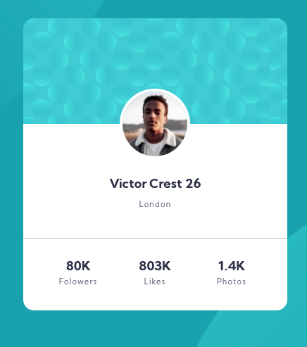

### Links

- Solution URL: [solution](https://github.com/sGabunia/profile-card-component)
- Live Site URL: [Go Live](https://zealous-bose-576cac.netlify.app/)

## Table of contents

- [Overview](#overview)
  - [The challenge](#the-challenge)
  - [Screenshot](#screenshot)
  - [Links](#links)
- [My process](#my-process)
  - [Built with](#built-with)
  - [What I learned](#what-i-learned)
- [Author](#author)

### Screenshot

## My process

### Built with

- Semantic HTML5 markup
- CSS custom properties
- Flexbox
- CSS Grid
- Mobile-first workflow
- pseudo elements

**Note: These are just examples. Delete this note and replace the list above with your own choices**

### What I learned

- Used pseudo elements for background

## Author

- Website - [Sergo Gabunia](https://github.com/sGabunia)
- Frontend Mentor - [@paran0ids82](https://www.frontendmentor.io/profile/paran0ids82)
- Twitter - [@sergo_gabunia](https://twitter.com/sergo_gabunia)
